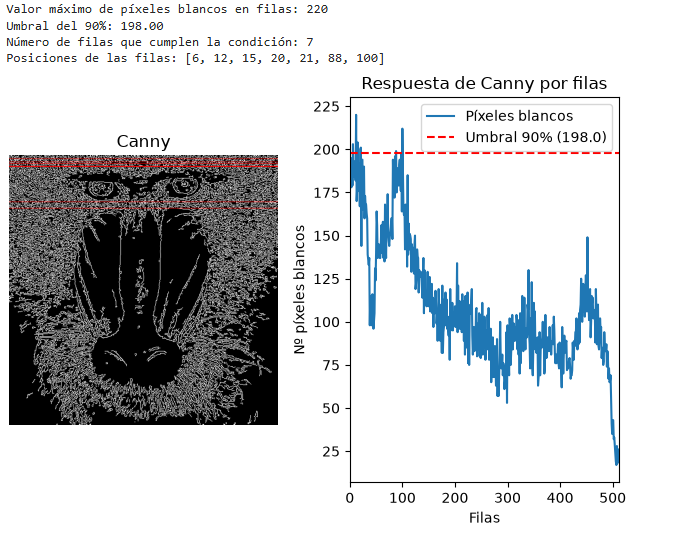
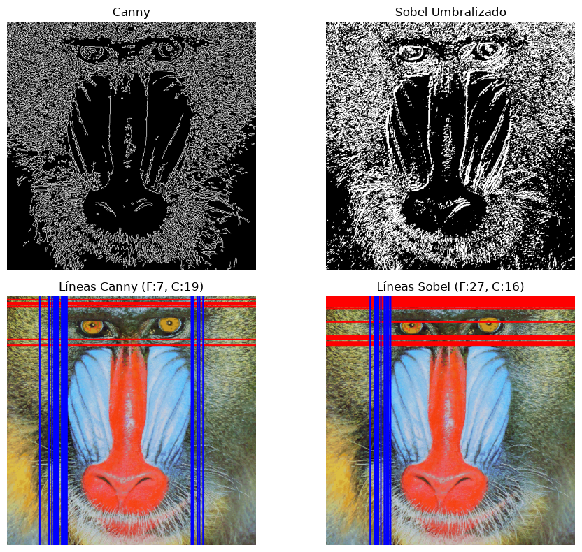
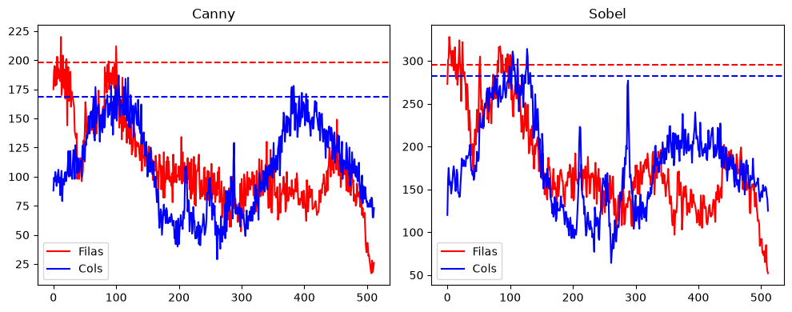

# Practica 2 VC

Ejercicios de la segunda práctica de laboratorio de VC.

Nicolás Hernández Castro y Gabriel Godoy Navarro - EII ULPGC 5 de octubre de 2026

## Tarea 1: Pixeles blancos por fila

En primer lugar, se lee la imagen del mandril y se convierte a niveles de grises con `cv2.cvtColor` para el procesamiento posterior. Luego, se aplica en la imagen el detector de contornos de Canny con umbral inferior 100 y umbral superior 200 con `cv2.Canny(gris, 100, 200)` para generar una imagen binaria limpia donde los píxeles con borde valen 255 y sin borde valen 0.

A continuación, se realiza el conteo de los valores de los pixeles por fila mediante la función `cv2.reduce(canny, 1, cv2.REDUCE_SUM, dtype=cv2.CV_32SC1)`. Se aplana la matriz vertical 2D a un vector unidimensional y como cada píxel blanco suma 255, se divide cada fila por 255 para saber el numero exacto de pixeles blanco por fila `(row_counts.flatten() / 255).astype(int)`. Sobre este vector se determina el valor máximo (220) usando `np.max` y se establece el umbral del 90% (198). Se localiza mediante `np.where(filas >= umbral)[0]` las 7 filas que cumplen dicha condición (corresponden a las posiciones 6, 12, 15, 20, 21, 88 y 100).

Por último, para señalizar estas posiciones de forma visible, se convierte la imagen binaria de Canny a tres canales con `cv2.cvtColor(canny, cv2.COLOR_GRAY2BGR)`, lo que permite dibujar en color sobre ella y se itera sobre las filas que cumplen la condición para trazar líneas horizontales sobre ellas con `cv2.line(canny_color, (0, y), (ancho - 1, y), (255, 0, 0), 1)`. En la imagen y en la gráfica se observa que las filas con mayor densidad de bordes se concentran en la parte superior del rostro del mandril.

## Tarea 2: Sobel umbralizado comparación con Canny

Primero, se lee la imagen del mandril y se convierte a escala de grises con `cv2.cvtColor`. Al igual que en la tarea anterior, se aplica el detector de Canny mediante `cv2.Canny(gris, 100, 200)` para obtener una imagen binaria con los bordes ajustados a un píxel de grosor.

Para el caso del operador de Sobel, se aplica inicialmente un filtro de suavizado con `cv2.GaussianBlur(gris, (3, 3), 0)` para reducir el ruido. Luego, se calculan las derivadas parciales en los ejes horizontal y vertical utilizando `cv2.Sobel`, se suman ambos gradientes y se escalan a 8 bits con `cv2.convertScaleAbs`. Para poder realizar una comparación con Canny, se binariza este resultado continuo mediante la función `cv2.threshold` con un valor de corte manual de 60, descartando así los gradientes más débiles y convirtiéndola en una máscara de valores 0 y 255.

A continuación, se realiza el recuento de los píxeles blancos tanto por filas como por columnas para ambos métodos. Para ello, se utiliza la función `cv2.reduce` indicando el eje correspondiente (1 para sumar a lo largo de las filas y 0 para las columnas) junto con el parámetro `cv2.REDUCE_SUM`. El resultado de cada proyección, al igual que en el caso anterior, se aplanará y se dividirá entre 255 para obtener la cantidad exacta de píxeles activos, transformando el arreglo a formato entero con `.astype(int)`.

Con los vectores de conteo ya calculados, se determina el valor máximo de píxeles para cada eje y para cada método utilizando `np.max`. A partir de estos máximos se establece matemáticamente el umbral del 90%. Mediante el uso de la función `np.where` se extraen los índices de aquellas filas y columnas concretas que alcanzan o superan este estricto límite, almacenando sus posiciones en arreglos independientes.

Por último, para señalizar estas posiciones de forma visible, se crean copias de la imagen original a color utilizando `cv2.cvtColor(img.copy(), cv2.COLOR_BGR2RGB)`. Se itera sobre las coordenadas filtradas previamente, trazando líneas horizontales `rojas (255, 0, 0)` para destacar las filas y líneas verticales `azules (0, 0, 255)` para las columnas a través de la función `cv2.line`. Todo el conjunto se muestra finalmente utilizando `Matplotlib`, exponiendo por un lado las máscaras binarias junto a las imágenes originales intervenidas, y por otro lado, las gráficas con los perfiles de conteo donde se superponen líneas discontinuas para evidenciar claramente dónde se sitúa el corte del umbral.

Sobel umbralizado genera contornos notablemente más gruesos y acumula gran cantidad de ruido en las áreas de alta textura del pelaje del mandril, a diferencia de Canny, que produce bordes limpios y finos. Este grosor adicional en Sobel provoca una acumulación masiva de píxeles blancos que dispara los picos máximos en las gráficas por encima de los 300 píxeles tanto en filas como en columnas. Específicamente, el recuento de Sobel presenta un pico extremo y muy estrecho en las primeras 50 filas, lo que eleva drásticamente la barrera de corte del 90% y hace que las 27 filas destacadas se agrupen formando una densa e ininterrumpida franja roja en la parte superior de la imagen. Por el contrario, Canny mantiene los contornos finos y evita que las zonas texturadas saturen el recuento, generando curvas con picos más moderados (rondando los 220 píxeles para las filas y menos de 200 para las columnas) y mejor distribuidos. Esta respuesta permite que el umbral del 90% de Canny atraviese diversas zonas estructurales de la imagen, resultando en 7 filas y 19 columnas destacadas que logran repartirse de manera más representativa por elementos clave del rostro, como el contorno de los ojos y los laterales del hocico.

## Tarea 3: Sobel umbralizado comparación con Canny
En primer lugar, se inicializa la captura de vídeo desde la cámara web utilizando `cv2.VideoCapture(0)`. A continuación, se configura un sustractor de fondo con `cv2.createBackgroundSubtractorMOG2(history=200, varThreshold=35, detectShadows=False),` lo que permitirá discriminar a la persona en movimiento del fondo estático. También se define un kernel elíptico con `cv2.getStructuringElement` que se usará para limpiar la imagen binarizada, y se establecen las variables principales de la partida, incluyendo un temporizador de inmunidad inicial apoyado en la librería estándar `time`.

Para gestionar los proyectiles interactivos, se implementa la función `nueva_bola(ancho)`. Esta función se encarga de crear esferas que caerán desde el borde superior de la imagen, asignándoles de forma aleatoria una coordenada X inicial, una velocidad de caída y un tipo específico. Existe un 30% de probabilidad de que la bola generada sea 'mala' frente a un 70% de que sea 'buena'.

Dentro del bucle principal del juego, se lee cada fotograma y se le aplica un efecto espejo horizontal mediante `cv2.flip(frame, 1)` para que la interacción del usuario con la pantalla resulte natural. Inmediatamente después, se aplica el sustractor de fondo para aislar la silueta del jugador. Dado que la detección puede generar "ruido" o píxeles aislados, la máscara binaria resultante se procesa con dos operaciones: una apertura (`cv2.morphologyEx con cv2.MORPH_OPEN`) para borrar el ruido y una dilatación (`cv2.dilate`) para expandir y unificar la zona de interacción que corresponde al cuerpo del usuario.

Entonces, se actualiza la posición de cada bola sumándole su respectiva velocidad en el eje Y. Para saber si el jugador ha tocado un objeto, basta con comprobar si la coordenada central de la bola sobre la `mascara_limpia` recae en un píxel blanco (valor 255). Si hay contacto con una bola buena, se suma un punto; si el contacto es con una bola mala y han pasado los 4 segundos de inmunidad inicial, se resta una vida. Si la bola es tocada o sobrepasa el límite inferior de la pantalla, es reubicada instantáneamente arriba.

Finalmente, se dibujan círculos de colores (verdes para objetos positivos y rojos para los negativos) usando `cv2.circle`, y se generan marcos parpadeantes en los bordes de la pantalla con `cv2.rectangle` al detectar un impacto. Los marcadores y estados (Puntos, Vidas, Inmunidad o GAME OVER) se proyectan en pantalla utilizando la función `cv2.putText`. El ciclo se repite continuamente mostrando tanto el juego como la máscara en ventanas separadas, finalizando y liberando los recursos de la cámara al presionar la tecla ESC.